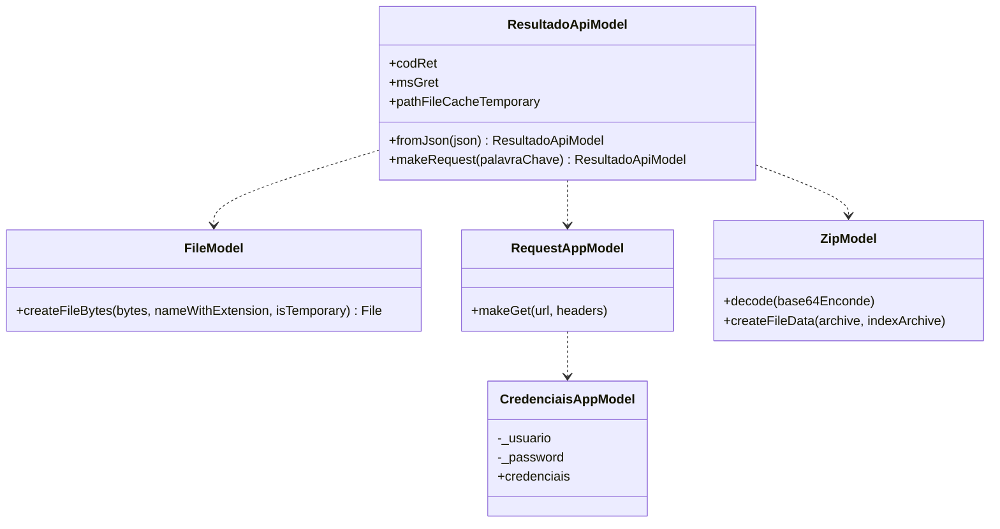

  

  
  
  

  
  
  
  

# Processo Seletivo MTB
Pequeno em Flutter realizado para a segunda etapa do processo seletivo, seguindo todas as diretrizes repassadas.

---
## Pacotes utilizados
---  
    -> Flutter
    - archive: ^3.3.5
    - flutter_mobx: ^2.0.6+5
    - http: ^0.13.5
    - mobx: ^2.1.3
    - path_provider: ^2.0.11
---  
## Diagrama de classes

